# XPS Exp module
A python module to read and process data from a X-ray photoelectron spectroscopy experiment.

For the full documentation, see: https://daniel-bertazzo.github.io/XPSExp/


# Information

This module offers a python class capable of handling data obtained from a X-ray Photoelectron
Spectroscopy (XPS) experiment. The main features include:

* Reading and storing information from a text file (``.txt``) containing data and metadata about a XPS experiment;
* Plotting and visualizing the data in various ways;
* Processing the data to obtain the sample spectrum;
* Correction of distortion (linear and quadratic) that may occur during the experiment;
* Saving the integrated data (spectrum) in VAMAS file format to be opened by other surface analysis softwares.

# Installation

## Requirements

In order to use this module, you must have the following Python libraries installed:

* [Pandas](https://pandas.pydata.org/)
* [Numpy](https://numpy.org/)
* [Xarray](http://xarray.pydata.org/en/stable/)


## Usage

This module consists of a single class contained in ``XPS_Experiment.py`` and some extra scripts (functions). therefore there is no actual installation process. You just need to download the file mentioned and keep it in your project directory. To import it to your code and use its features, do it like so:

```python    
from XPS_Experiment import *
```

# Examples

## Example 1: Obtaining the spectrum of a sample and save it to VAMAS format

For this example, the data will not have any distortion. 

Import module

```python
from XPS_Experiment import *
```

Create a XPS_Experiment object and read from file

```python
e = XPS_Experiment()
e.read_file("standard_Au/Au4f_200_0002.txt")
e.plot()
```


Note that there is no visible distortion in the data, so we can integrate it directly

```python
e.integrate()
e.plot_integrated()
```


Finally, saving the spectrum in VAMAS format

```python
e.save_vms("out/Au4f_200_0002.vms")
```

## Example 2: Correcting data distortion and obtaining the spectrum


For this example, we will try to correct two distorted experiments, integrate them to generate the spectrum, and compare them to the original (undistorted) data.

Importing module and instantiating objects

```python
from XPS_Experiment import XPS_Experiment
data_original = XPS_Experiment() # Original data
data_linear   = XPS_Experiment() # Linear distortion
data_quad     = XPS_Experiment() # Quadratic distortion
```

Reading data (not yet distorted)

```python
data_original.read_file("standard_Au/Au4f_200_50meV0001.txt") 
data_linear  .read_file("standard_Au/Au4f_200_50meV0001.txt")
data_quad    .read_file("standard_Au/Au4f_200_50meV0001.txt")
```

Adding distortion

```python
for y in range(data_original.data.shape[1]):
        data_linear.data[:, y] = shift(data_linear.data[:, y], y              , prefilter=False, order=0, mode='reflect')
        data_quad  .data[:, y] = shift(data_quad  .data[:, y], -0.015*y**2 + y, prefilter=False, order=0, mode='reflect')
```

Plotting 

```python
fig, (ax1, ax2, ax3) = plt.subplots(nrows=1, ncols=3, figsize=(25,5))

data_original.data.plot.pcolormesh(cmap='inferno', ax=ax1)
data_linear  .data.plot.pcolormesh(cmap='inferno', ax=ax2)
data_quad    .data.plot.pcolormesh(cmap='inferno', ax=ax3)

fig.suptitle("Particle position (mm) vs Kinetic energy (eV)", fontsize=16)

ax1.set_title("Original data"       , fontsize=13)
ax2.set_title("Linear distortion"   , fontsize=13)
ax3.set_title("Quadratic distortion", fontsize=13)

plt.show()
```

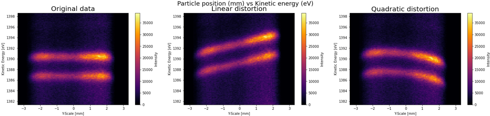

Integrating the data (generating the spectrum)

```python
data_original.integrate()
data_linear  .integrate()
data_quad    .integrate()
```

Plotting the spectra

```python
fig, (ax1, ax2, ax3) = plt.subplots(nrows=1, ncols=3, figsize=(25, 5))

data_original.int_data.plot.line(ax=ax1)
data_linear  .int_data.plot.line(ax=ax2)
data_quad    .int_data.plot.line(ax=ax3)

ax1.grid(linestyle="dotted")
ax2.grid(linestyle="dotted")
ax3.grid(linestyle="dotted")

fig.suptitle("Photon count as function of kinetic energy (eV)", fontsize=18)

ax1.set_title("Original data"       , fontsize=20)
ax2.set_title("Linear distortion"   , fontsize=20)
ax3.set_title("Quadratic distortion", fontsize=20)

plt.show()
```

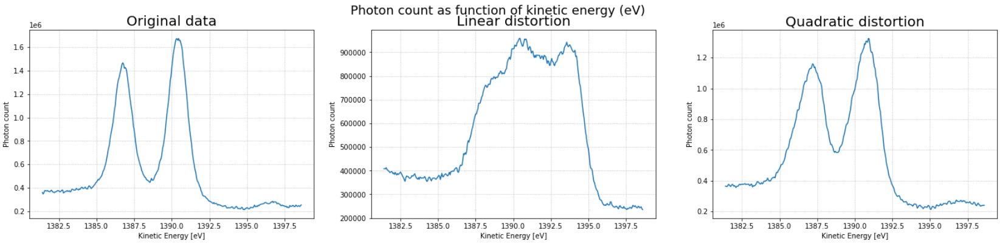

Note how the distortions affect the spectrum analysis, making it very difficult to precisely determine the sample's composing material (chemical elements).

Correcting the distortion

Setting a region of interest in which we will perform the operations

```python
data_linear.set_roi(init=-2.6, end=2.4)
data_quad  .set_roi(init=-2.6, end=2.4)
# Plotting
data_linear.plot(show_roi=True)
data_quad  .plot(show_roi=True)
```

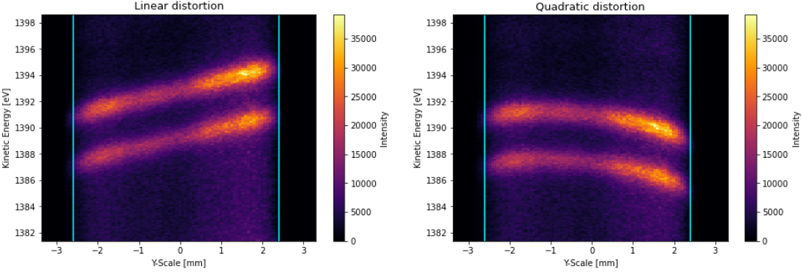

Dividing data into bins

```python
data_linear.divide(nbins=10)
data_quad  .divide(nbins=10)

data_linear.plot(show_roi=True, show_bins=True)
data_quad  .plot(show_roi=True, show_bins=True)
```

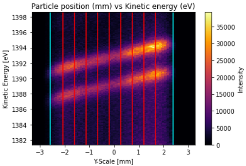
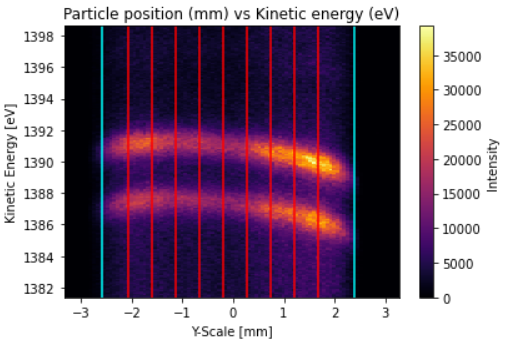

Integrating the bins and finding the points of maximum value in each bin

```python
data_linear.integrate_bins()
data_quad  .integrate_bins()

data_linear.calculate_max_points()
data_quad  .calculate_max_points()

data_linear.plot(show_roi=True, show_bins=True, show_max_points=True)
data_quad  .plot(show_roi=True, show_bins=True, show_max_points=True)
```

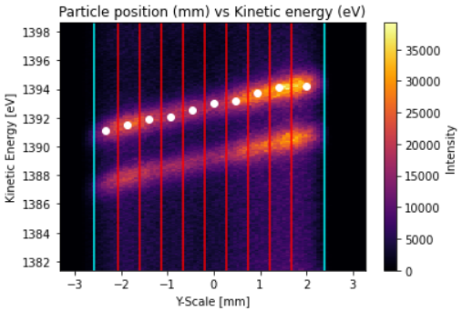
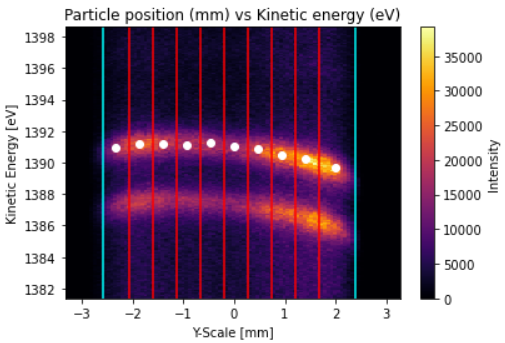

Fitting a curve to the max points

```python
data_linear.fit_max_points(deg=1) # 1st degree polynomial -> linear distortion
data_quad  .fit_max_points(deg=2) # 2nd degree polynomial -> quadratic distortion

data_linear.plot(show_roi=True, show_bins=True, show_max_points=True, show_fit=True)
data_quad  .plot(show_roi=True, show_bins=True, show_max_points=True, show_fit=True)
```


Fixing the data using the fit curve

```python
data_linear.fix_distortion()
data_quad  .fix_distortion()

data_linear.plot()
data_quad  .plot()
```

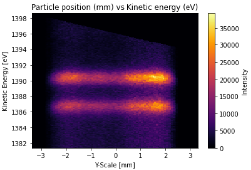
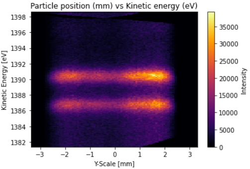

Integrating the data again and comparing it to the original, undistorted image.

```python
data_linear.integrate()
data_quad  .integrate()

data_.plot_integrated()
data_.plot_integrated()
```

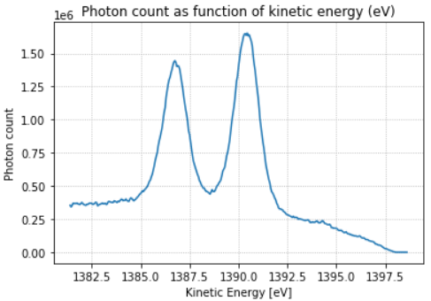


The original data:

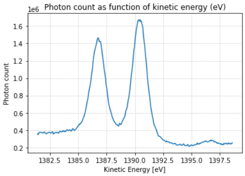

Note that the peaks occur at the same level of kinetic energy as the original image, and mantains its peak count value. The only thing that differs are the tails of the spectrum, which can be altered with background removal. This is a future goal of this module, but it has not yet been implemented.