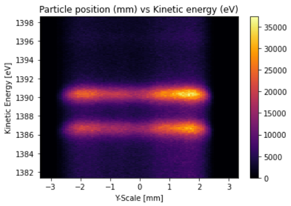
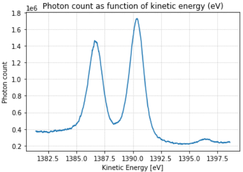

Example 1: Obtaining the spectrum of a sample and save it to VAMAS format
==========================================================================

For this example, the data will not have any distortion. 

Import module

>>> from XPS_Experiment import *

Create a XPS_Experiment object and read from file

>>> e = XPS_Experiment()
>>> e.read_file("standard_Au/Au4f_200_0002.txt")
>>> e.plot()

Note that there is no visible distortion in the data, so we can integrate it directly

>>> e.integrate()
>>> e.plot_integrated()

Finally, saving the spectrum in VAMAS format

>>> e.save_vms("out/Au4f_200_0002.vms")