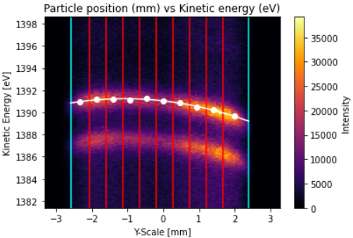
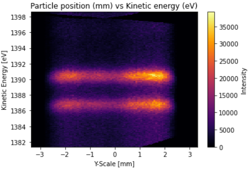
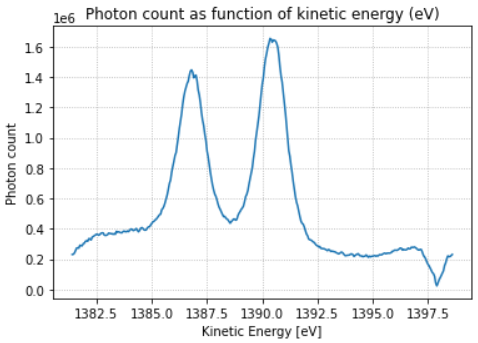

Example 2: Correcting data distortion and obtaining the spectrum
=======================================================================

For this example, we will try to correct two distorted experiments, integrate them to generate the spectrum, and
compare them to the original (undistorted) data.

Importing module and instantiating objects

>>> from XPS_Experiment import XPS_Experiment
>>> data_original = XPS_Experiment() # Original data
>>> data_linear   = XPS_Experiment() # Linear distortion
>>> data_quad     = XPS_Experiment() # Quadratic distortion

Reading data (not yet distorted)

>>> data_original.read_file("standard_Au/Au4f_200_50meV0001.txt") 
>>> data_linear  .read_file("standard_Au/Au4f_200_50meV0001.txt")
>>> data_quad    .read_file("standard_Au/Au4f_200_50meV0001.txt")

Adding distortion

.. code-block:: python
        
        for y in range(data_original.data.shape[1]):
                data_linear.data[:, y] = shift(data_linear.data[:, y], y              , prefilter=False, order=0, mode='reflect')
                data_quad  .data[:, y] = shift(data_quad  .data[:, y], -0.015*y**2 + y, prefilter=False, order=0, mode='reflect')

Plotting 

.. code-block:: python

        fig, (ax1, ax2, ax3) = plt.subplots(nrows=1, ncols=3, figsize=(25,5))

        data_original.data.plot.pcolormesh(cmap='inferno', ax=ax1)
        data_linear  .data.plot.pcolormesh(cmap='inferno', ax=ax2)
        data_quad    .data.plot.pcolormesh(cmap='inferno', ax=ax3)

        fig.suptitle("Particle position (mm) vs Kinetic energy (eV)", fontsize=16)

        ax1.set_title("Original data"       , fontsize=13)
        ax2.set_title("Linear distortion"   , fontsize=13)
        ax3.set_title("Quadratic distortion", fontsize=13)

        plt.show()

.. image:: _img/example2_1.png
        :width: 100%
        :align: center

Integrating the data (generating the spectrum)

>>> data_original.integrate()
>>> data_linear  .integrate()
>>> data_quad    .integrate()

Plotting the spectra

.. code-block:: python

        fig, (ax1, ax2, ax3) = plt.subplots(nrows=1, ncols=3, figsize=(25, 5))

        data_original.int_data.plot.line(ax=ax1)
        data_linear  .int_data.plot.line(ax=ax2)
        data_quad    .int_data.plot.line(ax=ax3)

        ax1.grid(linestyle="dotted")
        ax2.grid(linestyle="dotted")
        ax3.grid(linestyle="dotted")

        fig.suptitle("Photon count as function of kinetic energy (eV)", fontsize=18)

        ax1.set_title("Original data"       , fontsize=20)
        ax2.set_title("Linear distortion"   , fontsize=20)
        ax3.set_title("Quadratic distortion", fontsize=20)

        plt.show()

.. image:: _img/example2_2.png
        :width: 100%
        :align: center

Note how the distortions affect the spectrum analysis, making it very difficult to precisely determine the sample's 
composing material (chemical elements).

Correcting the distortion

Setting a region of interest in which we will perform the operations

.. code-block:: python

        data_linear.set_roi(init=-2.6, end=2.4)
        data_quad  .set_roi(init=-2.6, end=2.4)
        # Plotting
        data_linear.plot(show_roi=True)
        data_quad  .plot(show_roi=True)

.. image:: _img/example2_3.png
        :width: 100%
        :align: center

Dividing data into bins

.. code-block:: python
        
        data_linear.divide(nbins=10)
        data_quad  .divide(nbins=10)

        data_linear.plot(show_roi=True, show_bins=True)
        data_quad  .plot(show_roi=True, show_bins=True)

.. |example2_4| image:: _img/example2_4.png
   :width: 49%

.. |example2_5| image:: _img/example2_5.png
   :width: 49%

|example2_4| |example2_5|

Integrating the bins and finding the points of maximum value in each bin

>>> data_linear.integrate_bins()
>>> data_quad  .integrate_bins()

>>> data_linear.calculate_max_points()
>>> data_quad  .calculate_max_points()

>>> data_linear.plot(show_roi=True, show_bins=True, show_max_points=True)
>>> data_quad  .plot(show_roi=True, show_bins=True, show_max_points=True)

.. |example2_6| image:: _img/example2_6.png
   :width: 49%

.. |example2_7| image:: _img/example2_7.png
   :width: 49%

|example2_6| |example2_7|

Fitting a curve to the max points

        >>> data_linear.fit_max_points(deg=1) # 1st degree polynomial -> linear distortion
        >>> data_quad  .fit_max_points(deg=2) # 2nd degree polynomial -> quadratic distortion

        >>> data_linear.plot(show_roi=True, show_bins=True, show_max_points=True, show_fit=True)
        >>> data_quad  .plot(show_roi=True, show_bins=True, show_max_points=True, show_fit=True)

.. |example2_8| image:: _img/example2_8.png
   :width: 49%

|example2_8| |example2_9|

Fixing the data using the fit curve

        >>> data_linear.fix_distortion()
        >>> data_quad  .fix_distortion()

        >>> data_linear.plot()
        >>> data_quad  .plot()

.. |example2_10| image:: _img/example2_10.png
   :width: 49%

|example2_10| |example2_11|

Integrating the data again and comparing it to the original, undistorted image.

        >>> data_linear.integrate()
        >>> data_quad  .integrate()

        >>> data_.plot_integrated()
        >>> data_.plot_integrated()

.. |example2_12| image:: _img/example2_12.png
   :width: 49%

|example2_12| |example2_13|

The original data:

.. image:: _img/example2_14.png
        :width: 400
        :align: center

Note that the peaks occur at the same level of kinetic energy as the original image, and mantains its peak count value.
The only thing that differs are the tails of the spectrum, which can be altered with background removal. This 
is a future goal of this module, but it has not yet been implemented.